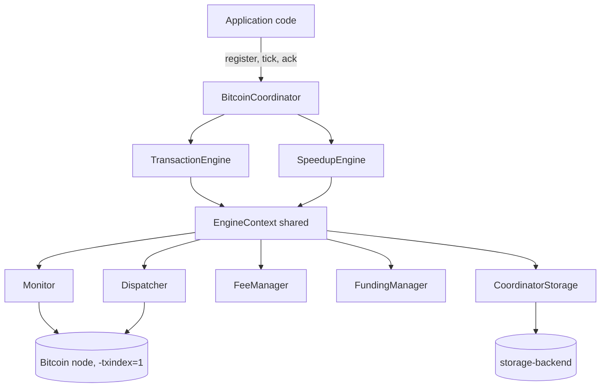
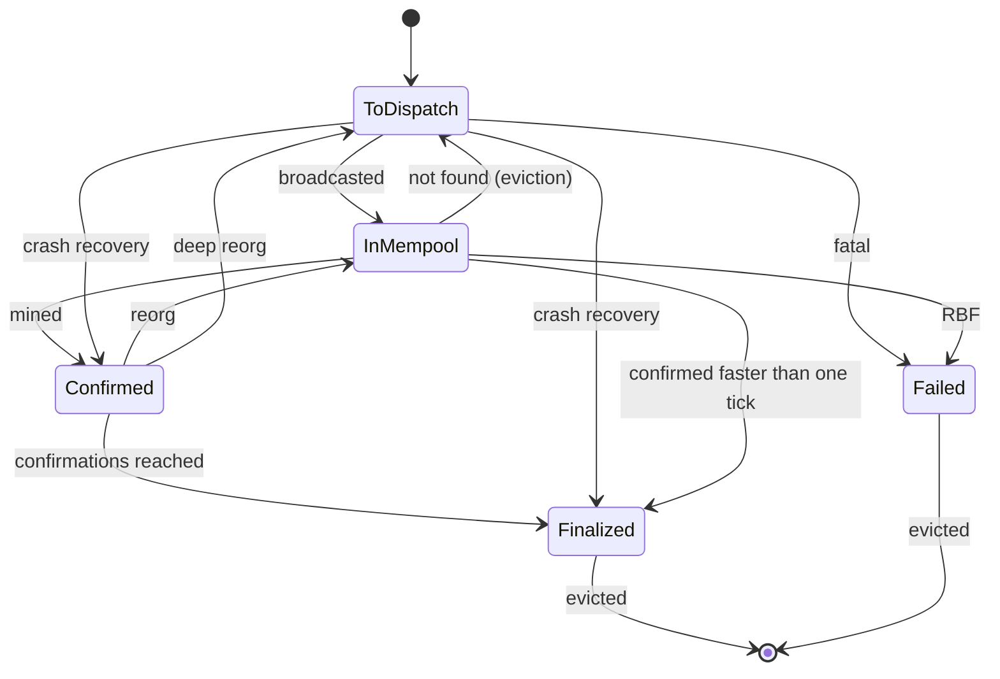
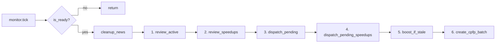
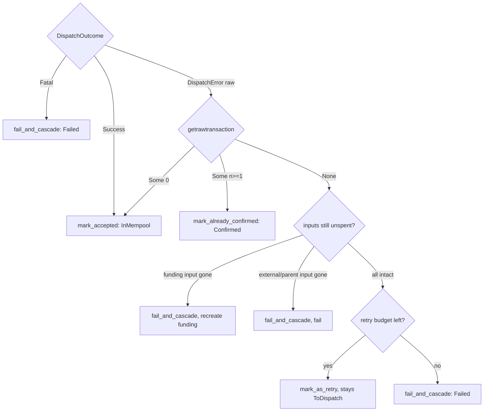

# Architecture

How the coordinator is put together and how a single `tick()` moves transactions
through their lifecycle. This document describes the present behavior. For the
rules and reasons behind it, see [design.md](design.md). For the speedup
subsystem in depth, see [speedup.md](speedup.md).

## What the coordinator does

`BitcoinCoordinator` sits between application code and a Bitcoin node. The
application registers signed transactions; the coordinator broadcasts them,
follows each one on-chain, keeps stuck ones moving with CPFP/RBF speedups, and
reports every state change back as news. All progress happens inside `tick()`,
which the application calls on a timer.

## Components

`BitcoinCoordinator` owns two engines. Both engines hold an `Rc<EngineContext>`,
so they share one set of services and one storage handle.

| Component | Responsibility |
|---|---|
| `BitcoinCoordinator` | Public API. Orchestrates the tick. Holds the two engines. |
| `TransactionEngine` | Reviews and dispatches non-speedup transactions (`Normal`, `NeedsSpeedup`). |
| `SpeedupEngine` | Reviews speedups, dispatches them, and builds CPFP/RBF boosts. |
| `EngineContext` | Shared service bundle. Both engines see the same storage, funding, dispatcher, and fee state. |
| `Monitor` (external) | Indexes blocks and mempool, answers per-transaction status. From `bitvmx-transaction-monitor`. |
| `Dispatcher` | Structural pre-checks, parent gating, and the actual RPC broadcast. |
| `FeeManager` | Network fee rate and speedup fee math. |
| `FundingManager` | Tracks the spendable funding UTXO chain. |
| `CoordinatorStorage` | Persists `CoordinatedTx` records and news through `storage-backend`. |

## The unit of work: `CoordinatedTx`

Every transaction the coordinator knows about is a `CoordinatedTx`. Its `kind`
decides which engine owns it and what the coordinator may do with it.

| `TxKind` | Meaning | Owned by |
|---|---|---|
| `Normal` | Plain transaction, no speedup support. | `TransactionEngine` |
| `NeedsSpeedup(data)` | Parent that wants a CPFP. Carries signing/UTXO metadata until the CPFP is built. | `TransactionEngine` |
| `Speedup(CPFP \| RBF)` | A speedup the coordinator built. | `SpeedupEngine` |
| `Funding(data)` | A funding UTXO registered through `add_funding`. Never broadcast on its own. | `FundingManager` |

## Transaction lifecycle

A `CoordinatedTx` carries a `TransactionState`. The forward path is
`ToDispatch -> InMempool -> Confirmed -> Finalized`. The remaining edges exist
for crash recovery, mempool eviction, and reorgs.

| State | Meaning |
|---|---|
| `ToDispatch` | Registered, not yet broadcast (or re-queued for re-broadcast). |
| `InMempool` | Accepted by the node, waiting to be mined. |
| `Confirmed` | Mined, below the finality threshold. |
| `Finalized` | Reached `max_monitoring_confirmations`. Treated as permanent. |
| `Failed` | Terminal failure. Settled by classification or RBF cleanup. |

`Finalized` and `Failed` are terminal for processing; records sit there until
`max_tracking_confirmations` blocks pass, then storage evicts them and emits
`TransactionEvicted`.

## The tick pipeline

`tick()` first advances the monitor and returns early if the monitor has not
caught up with the chain (`is_ready()` is false). Once ready, it cleans up
acknowledged news and runs six steps in a fixed order. Review steps never
broadcast; dispatch steps never decide finality. The order is load-bearing and
is explained in [design.md](design.md).

| Step | Method | What it does | Dispatches? |
|---|---|---|---|
| 1 | `review_active` | Reads chain status of in-flight `Normal` / `NeedsSpeedup` txs. Applies reorg, finalize, confirm, orphan, and not_found transitions. | No |
| 2 | `review_speedups` | Same review for speedups. Re-queues evicted speedups, settles replaced RBF chains. | No |
| 3 | `dispatch_pending` | Broadcasts `ToDispatch` non-speedups whose `target_block_height` is reached. | Yes |
| 4 | `dispatch_pending_speedups` | Broadcasts `ToDispatch` speedups built in a prior tick or re-queued in step 2. | Yes |
| 5 | `boost_if_stale` | If the live speedup tip is stale, builds one boost (CPFP or RBF) and saves it `ToDispatch`. | No (saves only) |
| 6 | `create_cpfp_batch` | Builds one CPFP covering pending `NeedsSpeedup` parents and saves it `ToDispatch`. | No (saves only) |

Steps 3 and 4 are ordered parent-before-child: a re-dispatched parent is back in
the node mempool before its CPFP is re-broadcast in the same tick. Steps 5 and 6
only build and save; the broadcast happens on the next tick.

## Dispatch classification

When the dispatcher broadcasts a transaction it returns one of three outcomes.
The engine, not the error string, decides what the outcome means by probing live
node state. This requires the node to run with `-txindex=1`, which the
coordinator asserts at construction.

| Outcome | Meaning | Action |
|---|---|---|
| `Success` | Node accepted the broadcast. | `InMempool`. |
| `Fatal(msg)` | Deterministic pre-send rejection (oversize, zero inputs). | `Failed` immediately, no node probe. |
| `DispatchError(raw)` | Node rejected for some other reason. | Classify against live node state, see below. |

Classification of a `DispatchError`:

1. `getrawtransaction(txid)` says the node already has it. `Some(0)` means the
   mempool already holds it, treat as accepted. `Some(n>=1)` means it is already
   mined, settle `Confirmed`.
2. The tx is absent, so a missing or spent input is definitive. A funding input
   gone means recreate funding; an external or parent input gone means fail. Both
   branches are first gated by the reorg-flap fail guard (see
   [design.md](design.md)).
3. Inputs are intact and the cause is unknown (fee or policy). Retry until
   `retry_attempts_sending_tx` is spent, then fail.

The `Failed` paths route through `fail_and_cascade`, which also settles every
`ToDispatch` speedup that depends on the failed transaction.

## News

Every meaningful event is published as news. The application pulls news with
`get_news()` and must acknowledge each item with `ack_news()` after acting on it.
News is deduplicated by value within a block, so acking early can drop a repeat.
Internal CPFP/RBF speedup transactions are filtered out of the transaction news
the client sees.

| News | Fired when |
|---|---|
| `TransactionStuckInMempool` | A non-speedup tx sits in the mempool past `stuck_in_mempool_blocks`. |
| `DispatchError` | A non-speedup tx failed to dispatch (after retries / on fatal / on input gone). |
| `SpeedupDispatchError` | A speedup failed to dispatch. |
| `TransactionEvicted` | A settled record was removed after `max_tracking_confirmations`. |
| `MaxFeeRateReached` | A speedup's package rate hit the `max_feerate_sat_vb` cap; no further boosts. |
| `InvalidFundingUtxo` | `add_funding` got a UTXO below `min_funding_amount_sats`. |
| `FundingNotAvailable` | A speedup was needed but no funding UTXO is available. |
| `InsufficientFunds` | The funding UTXO cannot cover the next speedup fee. |
| `InvalidCancel` | A `cancel` request was refused (see the cancel rule in design.md). |
| `InvalidStateTransition` | A settle attempted an illegal state move (defensive). |
| `TxNotFound` / `EstimateFeerateTooHigh` | Lookup and fee-estimate edge reports. |

## Configuration

Tuning lives in `BitcoinSettings`. Every field is optional and falls back to the
defaults in `src/config/settings.rs`. The groups that shape behavior:

| Group | Field | Role |
|---|---|---|
| `coordinator` | `retry_interval_seconds` | Minimum wall-clock gap between retry batches. |
| `coordinator` | `retry_attempts_sending_tx` | Retry budget before a transient failure becomes `Failed`. |
| `dispatcher` | `max_tx_weight` | Upper bound on broadcastable weight. Over it is `Fatal`. |
| `fee` | `min_safe_fee_rate` | Floor and fallback for the effective speedup fee rate. |
| `fee` | `max_feerate_sat_vb` | Hard cap on the speedup package fee rate (parents + child). |
| `fee` | `base_fee_multiplier` | Multiplier on the network estimate. |
| `speedup` | `max_unconfirmed_speedups` | Boost stays CPFP below this in-mempool count, switches to RBF at it. |
| `speedup` | `min_blocks_before_resend_speedup` | Blocks a speedup tip must age before it is boosted. |
| `speedup` | `rbf_fee_multiplier`, `bump_fee_percentage` | Fee escalation factors. |
| `speedup` | `max_rbf_attempts` | Upper bound on RBF escalation. |
| `funding` | `min_funding_amount_sats` | Minimum accepted funding UTXO size. |
| `storage` | `max_tracking_confirmations` | Blocks a settled record is kept before eviction. |
| `monitor` | `max_monitoring_confirmations` | Confirmations to reach `Finalized`. Also the fail-guard window. |

Settings must not change across a restart on the same storage. Several
invariants assume the configuration that produced the persisted state is the one
used to resume it.
