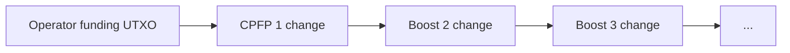
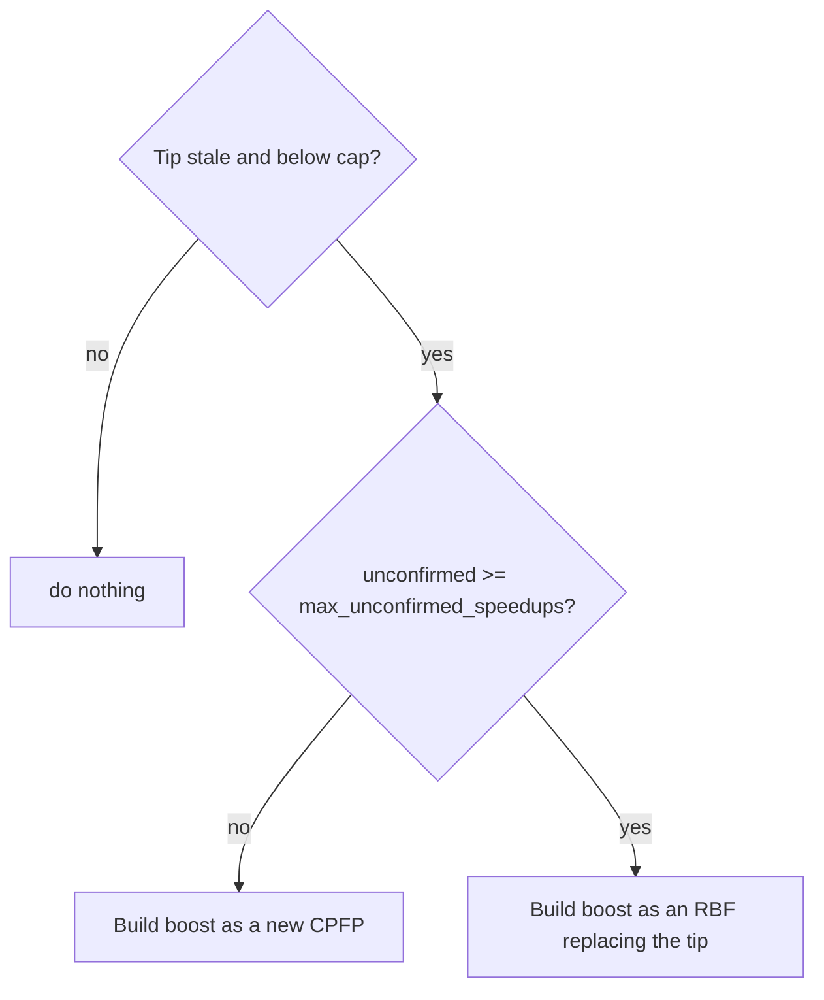

# Speedups

A speedup is a transaction the coordinator builds and broadcasts to pull a stuck
parent into a block faster. There are two kinds: CPFP (Child-Pays-For-Parent)
and RBF (Replace-By-Fee). This document explains when each is used, how speedups
are funded, and how their fees are computed. For the overall tick flow see
[architecture.md](architecture.md); for the rules behind the choices see
[design.md](design.md).

## Why speedups exist

A transaction can stall in the mempool when its fee rate is too low for current
demand. The coordinator does not edit the original transaction. Instead it
attaches more fee from a separate funding UTXO:

- CPFP: a child transaction spends an output of the stuck parent and pays a high
  fee, so a miner must include both to collect it.
- RBF: a replacement transaction spends the same inputs as a previous speedup but
  pays more, evicting the old one from the mempool.

Only `NeedsSpeedup` parents get speedup coverage. A `Normal` transaction is never
boosted automatically (the application can still attach its own CPFP through
`dispatch_without_speedup`).

## The anchor and the funding input

A first CPFP has two inputs:

| Input | Source | Purpose |
|---|---|---|
| Anchor | An output of the parent (`NeedsSpeedup`) transaction. | Ties the child to the parent so they confirm together. |
| Funding | The operator funding UTXO registered via `add_funding`. | Pays the extra fee. |

The change output of that CPFP becomes the funding input of the next boost. This
forms the funding chain.

## The funding chain

Funding flows forward through a chain of change outputs. The operator registers
one UTXO; each speedup spends the current chain tip and leaves a new change
output as the next tip.



Rules that keep the chain pointing at reality:

- The funding lookup walks from the live chain tip and skips speedups that are
  `Failed` or already replaced (`replaced_by` set), so the next boost chains off
  the actual live tip.
- When a speedup finalizes, its change output replaces the base funding entry, so
  the chain advances to the finalized output.
- When a funding UTXO is too small for the next fee, the coordinator advances the
  funding queue, and emits `InsufficientFunds` once the queue is empty.

## CPFP versus RBF

Each boost is either a new CPFP or an RBF. The choice depends only on how many
speedups are currently unconfirmed in the mempool:



| Boost kind | Built when | Effect |
|---|---|---|
| CPFP | Unconfirmed speedup count is below `max_unconfirmed_speedups`. | Adds another child on top of the chain tip. |
| RBF | Unconfirmed count has reached `max_unconfirmed_speedups`. | Replaces the chain tip in place, reusing its inputs and paying more. |

A boost is considered only when the live tip has aged at least
`min_blocks_before_resend_speedup` blocks and its package fee rate
(`package_fee_rate`) is still below `max_feerate_sat_vb`.

When an RBF is dispatched, its predecessor gets `replaced_by` set so the funding
walk and the staleness check skip it. The replaced chain is settled `Failed`
later, when the RBF finalizes.

## Fee model

Speedup fees use a plain package-rate model. The fee covers the combined virtual
size of the parents and the child at the chosen rate:

```
total_fee = (sum_parent_vsizes + child_vsize) * fee_rate
```

On top of that base:

| Term | Effect |
|---|---|
| `chain_diff_fee` | Tops up for the fee already paid by earlier unconfirmed speedups in the chain. |
| `bump_fee` multiplier (`bump_fee_percentage`) | Escalates multiplicatively on each successive boost. |
| BIP-125 bandwidth floor | For RBF only, the replacement must out-pay the predecessor by the network relay increment. |

The rate itself is bounded on both ends:

- Lower bound: `min_safe_fee_rate`. Used as the floor and as the fallback when the
  node has no fee estimate. Every boost must also out-pay its predecessor, so the
  rate is floored at `max(network_rate, predecessor_rate + 1)`.
- Upper bound: `max_feerate_sat_vb`. This is a cap on the package effective fee rate. 
  A CPFP/RBF child pays the parents' shortfall too, so `compute_speedup_fee` clamps the
  child fee at `max_feerate_sat_vb * (parent_vbytes + child_vsize) - parent_credit`, which
  keeps the parents-plus-child package at `max_feerate_sat_vb` sat/vB and flags the result
  as capped.

Each speedup stores two rates in its `FeeInfo`:

- `fee_rate` is the child transaction's own standalone rate (`fee_paid / child_vsize`).
- `package_fee_rate` is the effective rate of the whole package the child funds,
  `(parent_credit + fee_paid) / (parent_vbytes + child_vsize)`. 

## Reaching the cap

Escalation stops once the package rate reaches `max_feerate_sat_vb`:

- A boost whose package rate would exceed the cap is saved at the cap, and
  `MaxFeeRateReached` is emitted against it carrying the capped `package_fee_rate`.

## One pre-built speedup at a time

Building and broadcasting are split across ticks: a boost or CPFP is built and
saved `ToDispatch` in one tick (steps 5 and 6) and broadcast in the next (step
4). At most one pre-built speedup is in flight at a time, and `create_cpfp_batch`
short-circuits if any speedup is already `ToDispatch`. The reasons are covered by
invariants I1, I2, and I3 in [design.md](design.md).
